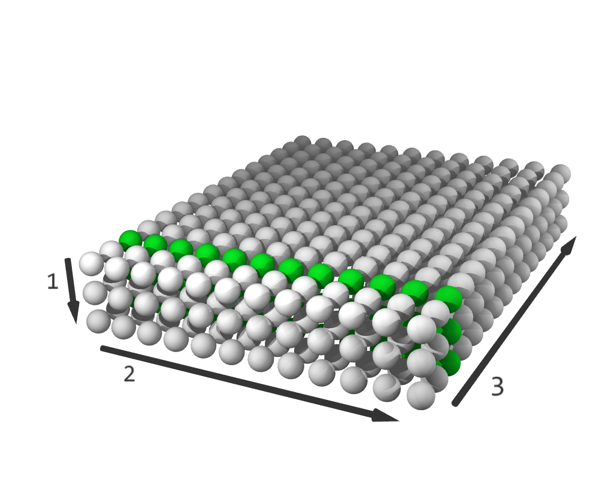
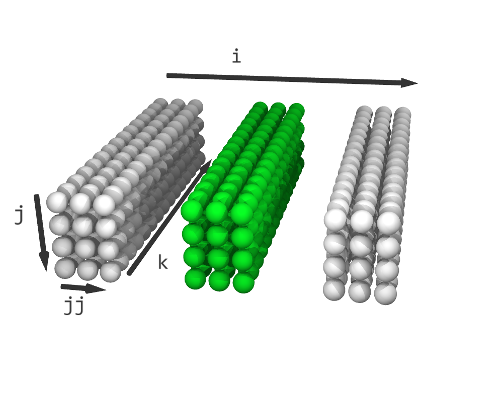
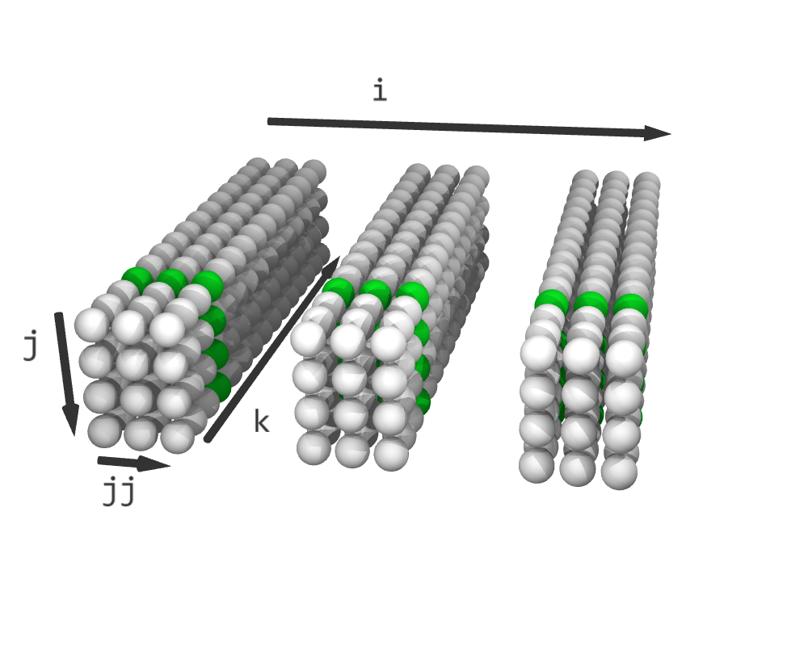
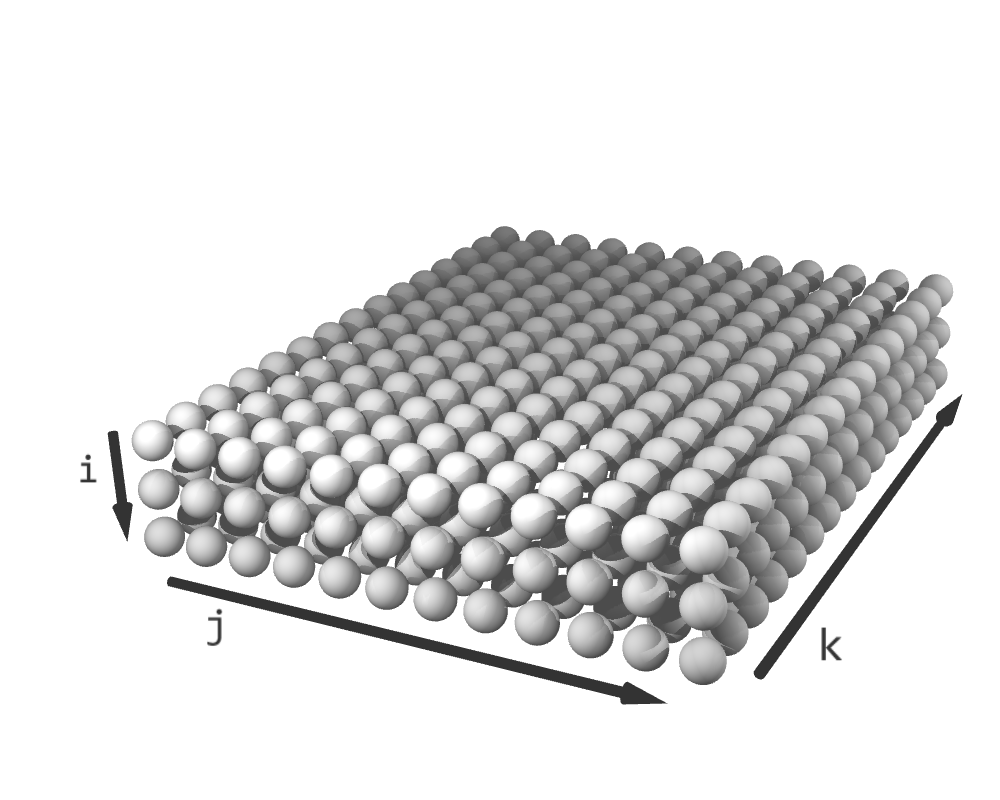
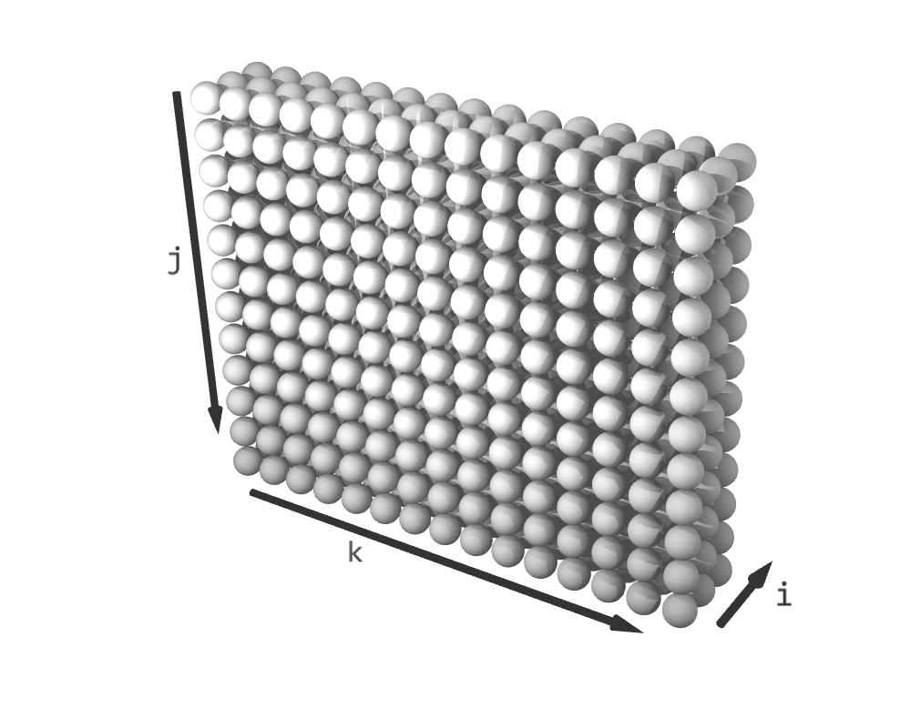

[//]: # (Project: Accera)
[//]: # (Version: v1.2.8)

# Section 3: Schedules
We begin with `nest` from [Section 2](<02%20Simple%20Affine%20Loop%20Nests.md>) which captures the logic of matrix-matrix multiplication. We use `nest` to create a `Schedule` that controls the execution order of the nest's iterations. Schedules are target-independent in the sense that the same schedule can be used to emit code for multiple target platforms.

We create a default schedule as follows:
```python
schedule = nest.create_schedule()
```

The default schedule is equivalent to the following straightforward for-loop version of the loop nest:
```python
for i in range(3):
    for j in range(12):
        for k in range(15):
            C[i, j] += A[i, k] * B[k, j]
```
In other words, each of the logical pseudo-code loops in `nest` becomes an actual for-loop in the default schedule. The for-loop sizes can be known at compile-time or at runtime.

We can now transform this schedule in various ways. However, these transformations do not change the underlying logic defined in `nest` and merely change the order of the loop iterations. We can even generate as many independent schedules as we want by calling `nest.create_schedule()`.

## Iteration spaces: a geometric representation of schedules
In the Accera programming model, a schedule is geometrically interpreted as a multi-dimensional discrete hypercube called the *iteration space* of the nest. The elements of the iteration space represent the individual iterations of the loop nest. Initially, the dimensions of the iteration space correspond to the logical loops defined in `nest`. 

For example, the default iteration space for the matrix-matrix multiplication nest forms a three-dimensional discrete hypercube, whose shape is (3, 12, 15):


*The (3, 12, 15) iteration space. The arrows labelled 1, 2, and 3 indicate the dimension order and direction.*

### How does an iteration space imply an order over the iterations?
The dimensions of the iteration space are ordered, and this order corresponds to the original order of the logical loops in `nest` by default. In fact, the order over the dimensions induces a lexicographic sequence over the individual elements of the iteration space.

[](https://www.youtube.com/watch?v=MYiwLVS4mLM "Iteration sequence")

*Video showing sequence of iterations for the (3, 12, 15) iteration space.*

This geometric interpretation of schedules helps us visualize how different transformations modify them. While some transformations merely rearrange the elements of the iteration space, others increase its dimensions, and some even pad the space with empty (no-op) elements. The transformed iteration space defines a new lexicographic order over the individual iterations.

Comment: It is important not to confuse arrays, like `A`, `B`, `C`, with iteration spaces, like `schedule`. A possible source of confusion could be that both arrays and iteration spaces have a multidimensional rectilinear structure (i.e., they both look like hypercubes). However, arrays and iteration spaces are fundamentally different. Arrays are data structures whose elements are scalars. Iteration spaces are abstract geometric representations of schedules and their elements represent individual iterations of a loop nest. Transformations apply to iteration spaces, not to arrays.

Comment: Accera's geometric interpretation of schedules resembles the *iteration domain polyhedron*, which is the cornerstone of the [polyhedral model](https://en.wikipedia.org/wiki/Polytope_model) of compiler optimization. However, unlike polyhedrons, Accera iteration spaces are not embedded in a continuous space and cannot be manipulated by algebraic transformations. Accera iteration spaces always remain rectilinear and are inherently discrete objects.

### Iteration space slices
*Iteration space slices* is an abstract concept that affects different aspects of the Accera programming model. Since the iteration space dimensions are ordered, each element of the iteration space can be identified by a vector of coordinates.  For example, the vector (1, 6, 7) identifies the iteration at position 1 along the first dimension, position 6 along the second dimension, and position 7 along the third dimension. If one or more coordinates are replaced with the *wildcard* symbol `*`, we get an *iteration space slice*, which is a set of iterations obtained by replacing the wildcard with all possible values. For example, (\*, \*, 2) represents a slice containing all the elements with 2 as their last coordinate. The *dimension of a slice* equals the number of wildcards in its definition.



*The (3, 12, 15) iteration space. Highlighted elements belong to the (\*, \*, 2) slice.*

Iteration space slices in four dimensions, denoted by indices (`i`, `j`, `jj`, `k`):

 |  | 
:-------------------------:|:-------------------------:|:-------------------------:
*(1, \*, \*, \*)* |  *(\*, \*, \*, 3)* | *(2, \*, 0, \*)*

### Loops, indices, and dimensions
When we defined `nest`, we used variables such as `i`, `j`, and `k` to name the loops in the loop-nest. When we described the default schedule using equivalent for-loops, `i`, `j`, and `k` became the index variables of those loops. Now, when we represent a schedule as an iteration space, these variables are used as the names of the corresponding iteration space dimensions. From here on, we move seamlessly between these different representations and use the terms *loop*, *index*, and *dimension* interchangeably.

## Schedule transformations
Iteration space transformations change the shape of the iteration space, possibly by adding dimensions or padding the space with empty elements.

The iterations space always retains its rectilinear (hypercube) shape. In some cases, Accera transformations must pad the iteration space with empty elements to avoid reaching a jagged iteration space structure.

### `reorder`
```python
# Reorder the indices.
schedule.reorder(k, i, j)
```

The `reorder` transformation sets the order of indices in the schedule. From the iteration space point-of-view, `reorder` performs a pivot rotation of the iteration space, which orients its dimensions in a specified order. Since the iteration space elements are executed in lexicographic order, pivoting the iteration space is equivalent to reordering the loops.

For example, we can write:
```python
schedule.reorder(j, k, i)
```
After this transformation, `schedule` becomes equivalent to:
```python
for j in range(12):
    for k in range(15):
        for i in range(3):
            C[i, j] += A[i, k] * B[k, j]
```

  |  
:-------------------------:|:-------------------------:
*Default schedule, order is (i, j, k)*` |  *After `reorder(j, k, i)`, order is (j, k, i)*

#### Invalid orders

Some orders are not allowed. Describing these restrictions in full will require concepts that are yet to be introduced. Therefore, we are stating these restrictions here and will discuss them later in the upcoming sections. The restrictions are:
1. The *inner dimension* created by a `split` transformation (see below) must be ordered later than its corresponding *outer dimension*.
2. The *fusing dimension* created by a `fuse` operation (see [Section 4](<04%20Fusing.md>)) must always precede any *unfused dimensions*.


Also note that `reorder` can also have the following overloaded form:
```python
schedule.reorder(order=(j, k, i))
```
This form is better suited for use with parameters (see [Section 9](<09%20Parameters.md>)).

### `split`
```python
# Splits dimension i into equally-sized parts, orients those parts along a new dimension ii, and stacks those parts along dimension i
ii = schedule.split(i, size)
```

From the iteration space point-of-view, the `split` transformation takes a dimension `i` and a `size`, modifies `i`, and creates a new dimension `ii`. Assume that the original size of dimension `i` was *n*: The `split` transformation splits the dimension `i` into *ceil(n/size)* parts of size `size`, orients each of these parts along dimension `ii`, and stacks the *ceil(n/size)* parts along the dimension `i`. If the split size does not divide the dimension size, empty elements are added such that the split size does divide the dimension size. As a result of the split, the size of `i` becomes *ceil(n/size)*, the size of the new dimension `ii` equals `size`, and the iteration space remains rectilinear.

In loop terms, `ii = split(i, size)` splits loop `i` into two loops: an inner loop `ii` and an outer loop, which inherits the original name `i`. Note that the outer loop always precedes the corresponding inner loop in the loop ordering.

For example, starting from `nest` defined in [Section 2](<02%20Simple%20Affine%20Loop%20Nests.md>), we could write:
```python
schedule = nest.create_schedule()
jj = schedule.split(j, 3)
```
The resulting iteration space has a shape of (3, 4, 3, 15) and corresponds to the following python code:
```python
for i in range(3):
    for j in range(0, 12, 3): # length 4, stride 3
        for jj in range(3):
            for k in range(15):
                C[i, j+jj] += A[i, k] * B[k, j+jj]
```
Note that loop `j` is no longer normalized (it has a stride of 3 rather than 1), which means that the nest is no longer a simple nest. As mentioned in the previous section, `Nest` objects always represent simple nests, but `Schedule` objects can represent more complex affine loop nests.

  |  
:-------------------------:|:-------------------------:
*Default schedule* |  *After `split(j, 3)`*

After performing a split, both the outer index and the inner index can be split again. For example,
```python
schedule = nest.create_schedule()
jj = schedule.split(j, 3)
jjj = schedule.split(j, 2) # split the outer index j again
```
After the first split, the iteration space has the shape (3, 4, 3, 15). After the second split, the shape becomes (3, 2, 2, 3, 15). The transformed schedule corresponds to the following Python code:
```python
for i in range(3):
    for j in range(0, 12, 6): # length 2, stride 6
        for jjj in range(0, 6, 3): # length 2, stride 3
            for jj in range(3):
                for k in range(15):
                    C[i, j+jj+jjj] += A[i, k] * B[k, j+jj+jjj]
```

The split does not necessarily need to divide the dimension size. For example, consider the following code:
```python
schedule = nest.create_schedule()
jj = schedule.split(j, 5)  # original size of dimension j was 12
```
From the iteration space point-of-view, this code splits dimension `j` into three parts of size 5, where the last part is padded with empty (no-op) elements. Before the transformation, the iteration space shape is (3, 12, 15), and after the transformation, the shape is (3, 3, 5, 15) (so, 135 empty elements were added).

  |  
:-------------------------:|:-------------------------:
*Default schedule (no-op elements in blue)* |  *After `split(j, 5)`*

In loop form, the transformed iteration space corresponds to the following Python code:
```python
for i in range(3):
    for j in range(0, 12, 5):
        for jj in range(5):
            for k in range(15):
                if j+jj < 12
                C[i, j+jj] += A[i, k] * B[k, j+jj]
```
Note that Accera optimizes away costly `if` statements by *unswitching* the loops, which results in code that looks more like this:
```python
for i in range(3):
    for j in range(0, 10, 5):
        for jj in range(5):
            for k in range(15):
                C[i, j+jj] += A[i, k] * B[k, j+jj]
        # loop unswitching: handle the last iteration of the j loop separately
        for j in range(10, 12):
            for k in range(15):
                C[i, j] += A[i, k] * B[k, j]
```

#### Meaningless splits
Next, we will describe Accera’s behavior in a few degenerate cases. If the split size equals the dimension size, the transformation simply renames the split dimension. For example,
```python
schedule = nest.create_schedule()
jj = schedule.split(j, 12) # original size of dimension j was 12
```
After the split, the size of `j` becomes 1 and the size of `jj` is `12`. The new shape of the iteration space is (3, 1, 12, 15). The dimension `j` becomes meaningless and therefore the schedule is basically unchanged.

If the split size exceeds the dimension size, Accera will treat it as if the split size doesn't divide the dimension size. This special case is handled by adding empty elements. For example,
```python
schedule = nest.create_schedule()
jj = schedule.split(j, 13)  # original size of dimension j was 12
```
After the split, the size of `j` becomes 1 and the size of `jj`, 13. The new shape of the iteration space is (3, 1, 13, 15), which means that 45 empty elements were added. These empty elements are removed during code generation, which means that the schedule is basically unchanged.

Finally, note that `jj = schedule.split(j, 1)` simply adds a meaningless new dimension `jj` of size 1, and again, the schedule is unchanged.

### Convenience syntax: `tile`
The `tile` transformation is a convenience syntax and does not provide any unique functionality. Consider the following code
```python
schedule = nest.create_schedule()
jj, kk = schedule.tile({
    j: 2,
    k: 3
})
```
The `tile` transformation above is shorthand for the following sequence of transformations:
```python
jj = schedule.split(j, 2)
kk = schedule.split(k, 3)
```

It will result in a sequence of indices that are ordered as:
```
(i, j, jj, k, kk)
```
In other words, the `tile` transformation takes a tuple of indices and a tuple of sizes, splitting each index by the corresponding size. The indices involved in the split are then ordered such that each of the outer indices (parent index) precedes its inner indices (child index). On the other hand, indices that did not participate in the transformation retain their relative positions.

### `skew`
```python
# Skew dimension i with respect to dimension j.
schedule.skew(i, j)
```

The `skew` transformation is the easiest to explain for a two-dimensional iteration space of shape *(N, M)*. Skewing dimension `i` (the row dimension) with respect to `j` (the column dimension) modifies the iteration space column-by-column: column `j` gets *j* empty elements added to its start and *M-j-1* empty elements to its end. As a result, each column grows from size *N* to size *N+M-1*. Geometrically, the original iteration space elements take the form of a 45-degree parallelogram, embedded within a bounding rectangle of shape *(N+M-1, M)*. The element that used to be at coordinate *(i, j)* moves to coordinate *(i+j, j)*.

Similarly, skewing `j` with respect to `i` adds empty elements at the beginning and end of each row, resulting in an iteration space of shape *(N, N+M-1)*. In higher dimensions, we simply apply the two-dimensional skew transformation independently to each two-dimensional slice along the two specified dimensions.

To demonstrate the importance of this transformation, consider convolving a 10-element vector with a 3-element filter. The loop logic for this operation is defined as follows:
```python
import accera as acc

N = 10  # input size
K = 3  # filter size
M = N - K + 1  # output size = 8

A = acc.Array(role=acc.Array.Role.INPUT, shape=(N,))
B = acc.Array(role=acc.Array.Role.INPUT, shape=(K,))
C = acc.Array(role=acc.Array.Role.INPUT_OUTPUT, shape=(M,))

nest = acc.Nest(shape=(M, K))
i, j = nest.get_indices()

@nest.iteration_logic
def _():
    C[i] += A[i+j] * B[j]

schedule = nest.create_schedule()
```
`schedule` corresponds to an iteration space of shape (8,3), where the first dimension corresponds to the 8 elements of the output vector. This schedule calculates the outputs one by one: first `C[0]`, then `C[1]`, etc.

Here is the equivalent Python code:
```python
for i in range(8):
    for j in range(3):
        C[i] += A[i+j] * B[j]
```

Now, say that we apply the `skew` transformation as follows:
```python
schedule.skew(i, j)
```
This transformation results in an iteration space of shape (10, 3), where the first dimension corresponds to the 10 elements of the input. This transformed schedule processes the input elements one-by-one: it extracts all the information from `A[0]` (`A[0]` is only used in the calculation of `C[0]`), then moves on to `A[1]` (which contributes to both `C[0]` and `C[1]`), and so on.

In this example, the default schedule achieves memory locality with respect to array `C`, whereas the skewed schedule achieves memory locality with respect to array `A`.

In loop form, the transformed iteration space corresponds to the following Python code:

```python
for i in range(10):
    for j in range(3):
        if (i-j) >= 0 and (i-j) < 8:
            C[i-j] += A[i] * B[j]
```

Behind the scenes, *unswitching* the loops results in code that looks more like this:

```python
# triangle of height 2, width 3
for j in range(1):
    C[0-j] += A[0] * B[j]
for j in range(2):
    C[1-j] += A[1] * B[j]

# rectangle of shape (6, 3)
for i in range(2, 8):
    for j in range(3):
        C[i-j] += A[i] * B[j]

# upside-down triangle of height 2, width 3
for j in range(2):
    C[6+j] += A[8] * B[2-j]
for j in range(1):
    C[7+j] += A[9] * B[2-j]
```

Finally, note that some loops have small sizes that can be replaced by unrolls. To enable the unrolling of these small loops, we can use this optional parameter:

```python
schedule.skew(i, j, unroll_loops_smaller_than=3)
```

This will unroll all loops that are smaller than 3, which include the `range(2)` and `range(1)` loops in the example above.

### `pad`
```python
# Adds empty elements to the beginning of dimension i.
schedule.pad(i, size)
```

The `pad` transformation pads the beginning of dimension `i` with empty elements. This operation is meaningless by itself, but can be useful when used with splitting or fusing.

## Order-invariant schedules and safety
A schedule is *order-invariant* if its underlying logic doesn't depend on the execution order of its iterations. For example, schedules created from a single `Nest` (via `create_schedule()`) are order-invariant. All of the schedules discussed so far have been order-invariant.

A schedule is *safe* if its underlying logic is guaranteed to remain intact regardless of the applied transformations. Not all schedules are safe, but order-invariant schedules are. This is because the transformations introduced in this section only change the execution order of iterations without adding or removing any work.

In [Section 4](<04%20Fusing.md>), we introduce fused schedules, which are not order-invariant, but may still be safe.


<div style="page-break-after: always;"></div>
