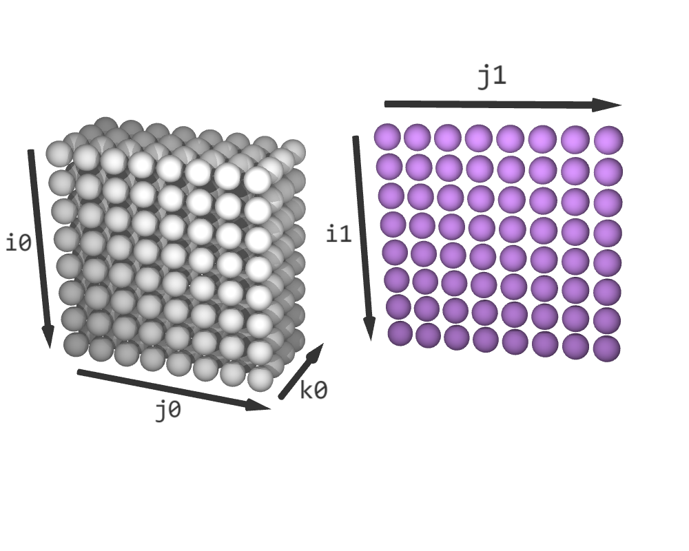
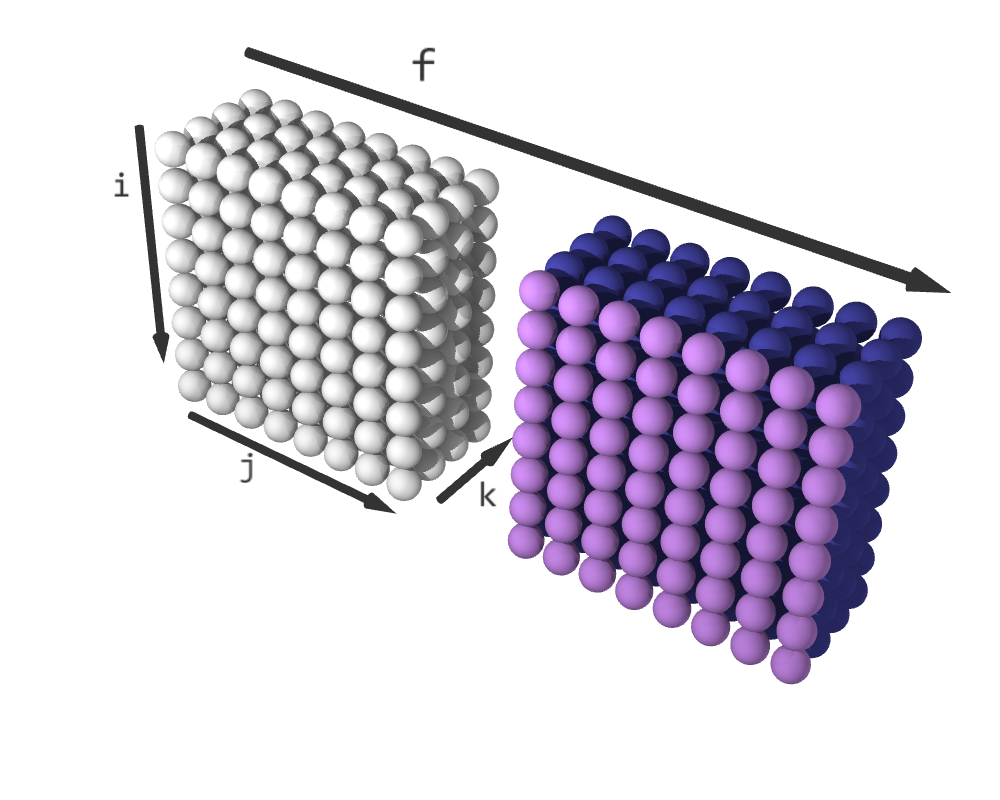
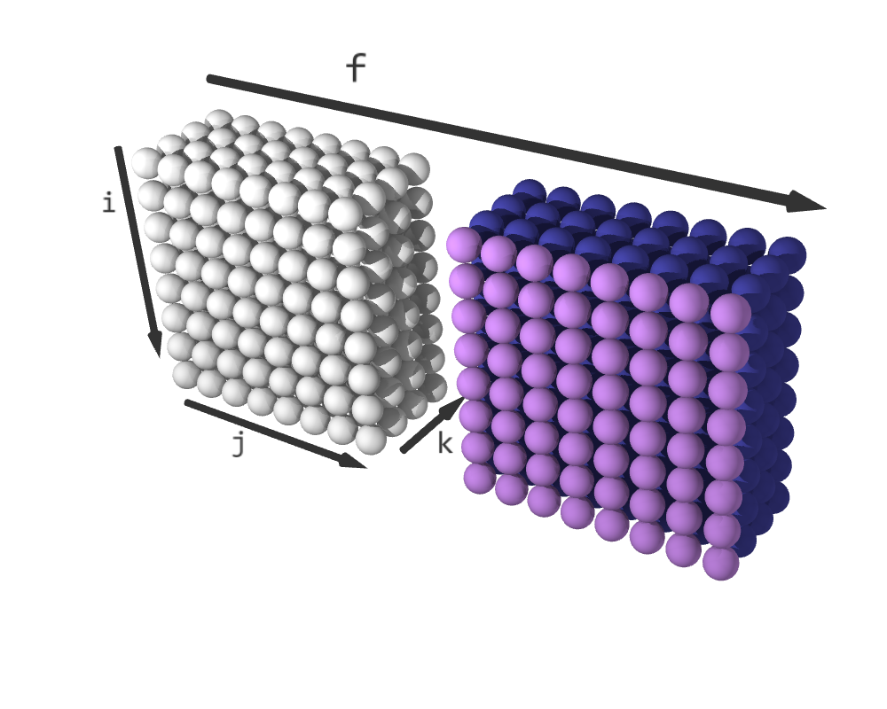
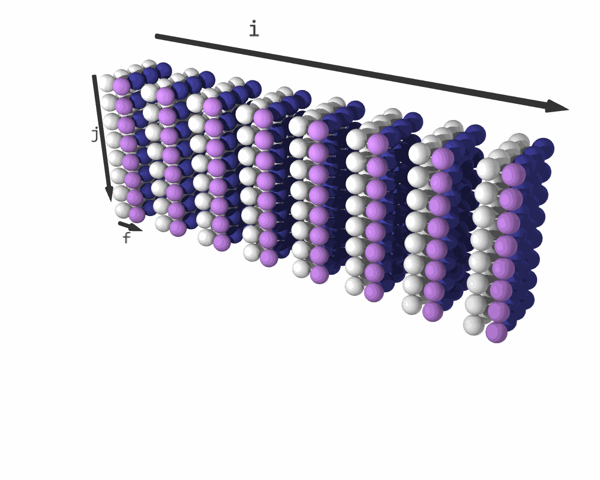
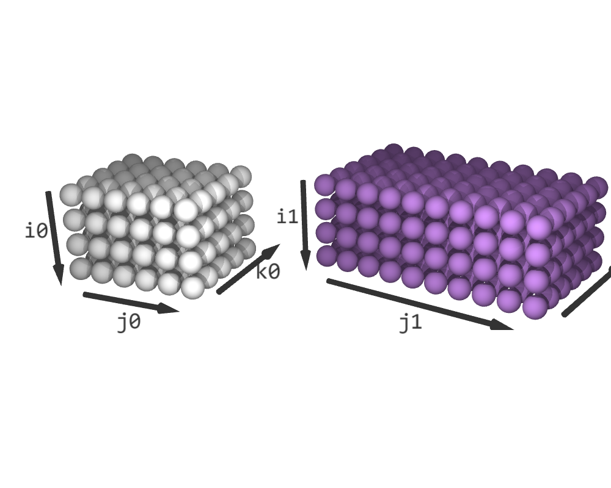
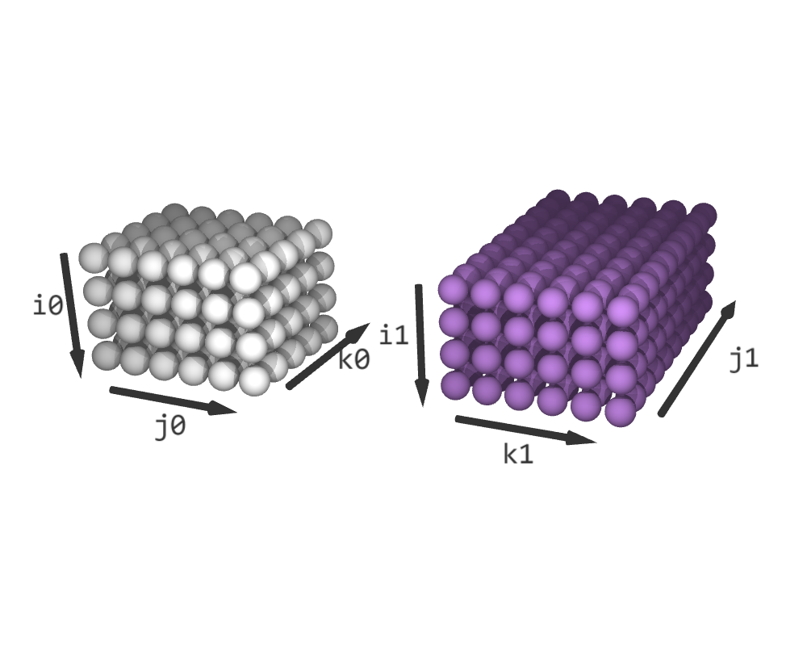
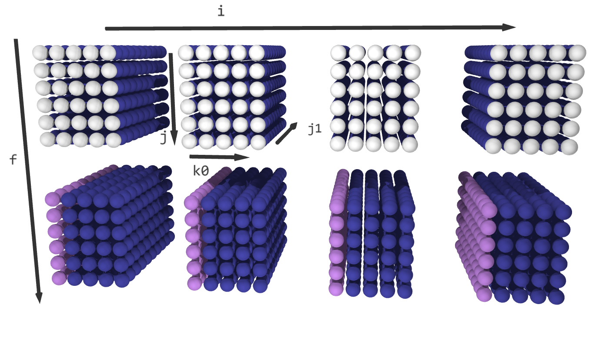

[//]: # (Project: Accera)
[//]: # (Version: v1.2.5)

# Section 4: Fusing
With `fuse` operation, multiple schedules can be combined into a single schedule representing the union of the work in the original schedules. These fused schedules can be transformed by any of the transformations presented in [Section 3](<03%20Schedules.md>).

## Full fusing
```python
import accera as acc

# Fuse three schedules to create a fused schedule
schedule = acc.fuse(schedule0, schedule1, ...)
```

*Full fusing* is the most straightforward, where each dimension is fused with the corresponding dimension from other schedules. 

### Full fusing of same-shaped iteration spaces
First, consider the simplest case where we fuse schedules with identical iteration space shapes. This fusing assigns a new dimension called *fusing dimension* to the fused schedule `schedule` that does not exist in the original schedules. By default, the fusing dimension is the first dimension in the fused schedule. Its size is equal to the number of fused schedules. The slices along the fusing dimension contain a copy of `schedule0`, `schedule1`. The first slice along the fusing dimension contains a copy of `schedule0`, the second slice contains a copy of `schedule1`, and so on. Since the fusing dimension is the first dimension, the fused schedule is logically equivalent to fully executing `schedule0`, followed by `schedule1`, and so on. We apply additional transformations to the fused schedule to interleave the original schedules.

Consider a scenario where we want first to shift and then scale each element of a matrix. In other words, we want to perform the equivalent of the below Python code:  
```python
C = (C + A) * B
```

If all three matrices are 10 by 10, one way to do this without fusing is to write: 
```python
A = acc.Array(role=acc.Array.Role.INPUT, shape=(10, 10))
B = acc.Array(role=acc.Array.Role.INPUT, shape=(10, 10))
C = acc.Array(role=acc.Array.Role.INPUT_OUTPUT, shape=(10, 10))

# Create nest_simple and schedule_simple
nest_simple = acc.Nest(shape=(10, 10))
i, j = nest_simple.get_indices()

@nest_simple.iteration_logic
def _():
    C[i, j] = (C[i, j] + A[i, j]) * B[i, j]

schedule_simple = nest_simple.create_schedule()
```
Note that each iteration in `schedule_simple` executes simultaneously on all three arrays. However, there can be a case where concurrent operation on these arrays creates excessive pressure on the computer’s memory cache, resulting in lower performance. In such a case, simultaneous operation on two arrays instead of three has a computational advantage.

Therefore, we may first want to compute `C += A` and then compute `C *= B`.  Better yet, we may want to compute `C` in 2&times;2 blocks. We first compute `C[0:2, 0:2] += A[0:2, 0:2]`. Subsequently, we compute `C[0:2, 0:2] *= B[0:2, 0:2]`. Finally, we move on to the next block and compute `C[2:4, 0:2] += A[2:4, 0:2]`, and so on. This way, fusing offers remarkable flexibility to explore all of these different execution possibilities. 

First, we define two separate nests, one for the `C += A` logic and one for the `C *= B` logic, and get their corresponding default schedules: 
```python
# Create nest0 and schedule0
nest0 = acc.Nest(shape=(10, 10))
i0, j0 = nest0.get_indices()

@nest0.iteration_logic
def _():
    C[i0, j0] += A[i0, j0]

schedule0 = nest0.create_schedule()

# Create nest1 and schedule1
nest1 = acc.Nest(shape=(10, 10))
i1, j1 = nest1.get_indices()

@nest1.iteration_logic
def _():
    C[i1, j1] *= B[i1, j1]

schedule1 = nest1.create_schedule()
```

Before fusing, both `schedule0` and `schedule1` have a shape (10, 10). Now, let’s fuse them:
```python
# Create a fused schedule
schedule = acc.fuse(schedule0, schedule1)
f, i, j = schedule.get_indices()
```
Fusing creates a new fused schedule `schedule` with a shape (2, 10, 10). It does not change `schedule0` and `schedule1`. The first dimension in `schedule` is the so-called fusing dimension `f`. Its slice (0, \*, \*) contains a copy of `schedule0`, and its slice (1, \*, \*) contains a copy of `schedule1`.

  |  
:-------------------------:|:-------------------------:
*Before fusing* |  *After `fuse(schedule0, schedule1)`*

In loop form, `schedule` is now equivalent to the following Python code:
```python
# f = 0
for i in range(10):
    for j in range(10):
        C[i, j] += A[i, j]
# f = 1
for i in range(10):
    for j in range(10):
        C[i, j] *= B[i, j]
```

Not much has happened until now since executing `schedule` as-is is equivalent to executing `schedule0` followed by `schedule1`. However, this can be changed by transforming the fused schedule. For example, we can recover `schedule_simple` by reordering the indices as follows:
```python
schedule.reorder(i, j, f)
```

  |  
:-------------------------:|:-------------------------:
*Before `reorder(i, j, f)`* |  *After `reorder(i, j, f)`*

The fusing dimension moves from the first position to the last position. Now, `schedule` is equivalent to the following Python code:
```python
for i in range(10):
    for j in range(10):
        # f = 0
        C[i, j] += A[i, j]
        # f = 1
        C[i, j] *= B[i, j]
```


*Resulting iteration sequence for `C = (C + A) * B`. (White elements represent `C + A`; purple elements are `C * B`)*

#### Tiling
Recall that we discussed computing the output block-by-block: first computing `C[0:2, 0:2] += A[0:2, 0:2]`, then computing `C[0:2, 0:2] *= B[0:2, 0:2]`, and so on. This can be achieved with the following sequence of transformations:
```python
ii, jj = schedule.tile({
    i: 2,
    j: 2
})
schedule.reorder(i, j, f, ii, jj)
```
The resulting `schedule` is equivalent to the following Python code:
```python
for i in range(0, 10, 2):
    for j in range(0, 10, 2):
        # f = 0
        for ii in range(2):
            for jj in range(2):
                C[i+ii, j+jj] += A[i+ii, j+jj]
        # f = 1
        for ii in range(2):
            for jj in range(2):
                C[i+ii, j+jj] *= B[i+ii, j+jj]
```
## Constraints of Fusing Dimension
The fusing dimension comes with certain constraints that are discussed from the `safety` perspective with examples. 

### Constraint 1: the fusing dimension is executed sequentially
Unlike other dimensions that allow parallelization, vectorization, or tensorization (see [Section 7](<07%20Plans%20-%20Operations%20and%20Optimizations.md>) ), none of these operations can be applied to the fusing dimension. The fusing dimension must be executed sequentially. This constraint enables the safety guarantee discussed below.   

### Safety
Before applying any subsequent transformations, the fused schedule is always logically equal to executing the original schedules sequentially. However, is it safe? Recall that a schedule is considered safe if the underlying logic is guaranteed to be unchanged regardless of the applied transformation. The safety of a fused schedule depends on circumstances that may break logic equivalence: 

Accera preserves the order of the fused schedules *for each value of the fused dimensions*, regardless of how the fused schedule is transformed. For example, in the example above, the fused dimensions are `i` and `j`. Therefore, for any concrete value of `i` and `j`, the corresponding operation from `schedule0` is guaranteed to execute before the corresponding operation from `schedule1`, regardless of how the fused schedule is transformed. More specifically, for each `i` and `j`, the operation `C[i, j] += A[i, j]` is guaranteed to execute before the operation `C[i, j] *= B[i, j]`, no matter how we transform the fused schedule. Since those are the only operations that interact with `C[i,j]`, the Accera guarantee is sufficient, and we can claim that the fused schedule is safe. With this assurance, the programmer can apply any sequence of transformations without worrying about the correctness of the resulting implementation.

However, not every fusing operation creates a safe schedule. For example, consider a scenario where we fused `schedule0` and `schedule1` differently:
```python
# Reorder schedule1 before fusing
schedule1.reorder(j1, i1)
# Fuse schedule0 with the reordered schedule1
schedule_t = acc.fuse(schedule0, schedule1)
f, a, b = schedule_t.get_indices()
```
In this unnatural example, `i0` and `j1` are fused and named `a`. Similarly,`i1` and `j0` are fused and named `b`. As mentioned above, Accera guarantees that, for each value of `a` and `b`, the operation `C[a, b] += A[a, b]` is executed before `C[b, a] *= B[b, a]`. The fusing operation itself preserves the logical equivalence. However, the underlying logic is changed if we transform the fused schedule as follows: 
```python
schedule_t.reorder(a, b, f)
```
To understand this change in the logic, note that the resulting schedule is equivalent to the following Python code:
```python
for a in range(10):
    for b in range(10):
        C[a, b] += A[a, b]
        C[b, a] *= B[b, a]
```
The above code sets `C[1,0]` to `C[1,0] * B[1,0] + A[1,0]`, whereas the original fused logic set `C[1,0]` to `(C[1,0] + A[1,0]) * B[1,0] `. In this case, we can conclude that `schedule_t` is definitely not safe. If the programmer decides to create an unsafe schedule, they take upon themselves the responsibility of maintaining logical equivalence.

### Fusing iteration spaces with different shapes
If the iterations spaces have different shapes, Accera matches their shapes by padding them appropriately with empty cells.

## Partial fusing
Instead of fusing all the dimensions, we may want to fuse a subset of dimensions, leaving the rest unfused. To fuse the first *s* dimensions, we use the syntax:
```python
# Fuse the first s dimensions of three schedules
schedule = acc.fuse((schedule0, schedule1, ...), partial=s)
```
The order of the dimensions in the fused schedule is as follows: first the fusing dimension `f`, then the fused dimensions *s*, followed by the unfused dimensions of `schedule0`, `schedule1`, and so on.

We can easily calculate the number of dimensions in the fused schedule. For example, if we fuse the first *s* dimensions of a *d0*-dimensional space `schedule0` and a *d1*-dimensional space `schedule1`, the fused iteration space will have *s* fused dimensions, *d0 + d1 - 2s* unfused dimensions, and the special fusing dimension `f`, for a total of *d0 + d1 - s + 1* dimensions.

The `fuse` operation uses padding to ensure that the fused iteration space is not jagged in any direction. For example, say that we partially fuse the first 2 dimensions of `schedule0`, which is 4-dimensional, and `schedule1`, which is 3-dimensional:
```python
schedule = acc.fuse((schedule0, schedule1), partial=2)
f, i, j, k, l, m = schedule.get_indices()
```
The first dimension is the fusing dimensions `f` of size 2. Next comes the fused dimensions `i` and `j`, followed by the unfused dimensions `k` and `l` from `schedule0` and `m` from `schedule1`. The slice (0, \*, \*, \*, \*, 0) contains a copy of `schedule0`, the slice (1, \*, \*, 0, 0, \*) contains a copy of `schedule1`, and the rest of `schedule` is padded with empty elements. Note that full fusing is a special case of partial fusing, where `s` is the larger of the dimensions of `schedule0` and `schedule1`.

### Constraint 2: the fusing dimension always precedes unfused dimensions
Another constraint introduced by partial fusing is that the fusing dimension must precede all of the unfused dimensions in its dimension order. This constraint applies to dimensions derived from the fusing dimension and the unfused dimensions via splitting.

### Safety
The safety guarantees for partial fusing are a natural extension of the guarantees for full fusing. *For each value of the fused dimensions*, Accera preserves the fused schedules' order regardless of how the fused schedule is transformed. In other words, for each concrete value of fused dimensions, all the corresponding work in `schedule0` (across all of its unfused dimensions) is performed before the corresponding work in `schedule1` (across all of its unfused dimensions). This remains true no matter how we transform the fused schedule. While fusing, the programmer needs to consider if this property implies safety. The below examples shows how this can be done. 

### Partial fusing example: fully-connected neural layer with activation
Consider applying an element-wise operation, such as the ReLU function of AI, to the result of a matrix-matrix multiplication. This is called a fully connected layer with a ReLU activation in the language of neural networks. The function `relu(x)` is simply `max(x,0)`.

Imagine that we have an element-wise operator `relu`, and we want to implement the equivalent Python code:
```python
C = relu(C + A @ B)
```
Here, `A` has a shape of (8, 4), `B` has a shape of (4, 8), and `C` has a shape of (8, 8). Let’s now define two nests, one for `C += A @ B` and the other for `C = relu(C)`, and obtain their corresponding default schedules:
```python
# Create nest0 and schedule0
nest0 = acc.Nest(shape=(8, 8, 4))
i0, j0, k0 = nest0.get_indices()

# nest0 performs C += A @ B
@nest0.iteration_logic
def _():
    C[i0, j0] += A[i0, k0] * B[k0, j0]

schedule0 = nest0.create_schedule()

# Create nest1 and schedule1
nest1 = acc.Nest(shape=(8, 8))
i1, j1 = nest1.get_indices()

# nest1 performs C = relu(C)
@nest1.iteration_logic
def _():
    C[i1, j1] = acc.max(C[i1, j1], 0)

schedule1 = nest1.create_schedule()
```
In `schedule0` and `schedule1`, the first dimension represents the rows of `C` and the second dimension represents the columns of `C`. Additionally, `schedule0` has a third dimension that `schedule1` does not have. Therefore, we fuse the first two dimensions of the iteration spaces and leave the third dimension of `schedule0` unfused.
```python
schedule = acc.fuse((schedule0, schedule1), partial=2)
f, i, j, k0 = schedule.get_indices()
```

The fused iteration space `schedule` has a shape of (2, 8, 8, 4). Its slice (0, \*, \*, \*) contains a copy of `schedule0`, the slice (1, \*, \*, 0) contains a copy of `schedule1`, and the rest of its elements are padded. Note that the code above overwrites the index `k0`, which initially was an index of `schedule0`. However, now it corresponds to the unfused index in `schedule`. Note that the name `k0` is a stylistic choice, we could have chosen a different name.

  |  
:-------------------------:|:-------------------------:
*Before fusing* |  *After `fuse((schedule0, schedule1), partial=2)` (padded elements in blue)*

#### Safety
Is `schedule` safe? Recall that for each value of `i` and `j`, Accera guarantees that the corresponding work in `schedule0` (`C[i,j] += A[i,k0] * B[k0,j]` for all values of `k0`) is executed before the corresponding work in `schedule1` (`C[i,j] = max(C[i,j], 0)`), and this holds regardless of how the fused schedule is transformed. Since these are the only operations that touch `C[i,j]` and the `ReLU` operation is always executed last, this warrants that `schedule` is safe. Therefore, we can focus all of our attention on optimizing performance without worrying about correctness from this point onwards.

Executing `schedule` as-is is equivalent to executing `schedule0` in its entirety, followed by executing `schedule1`. Suppose we want to interleave the two schedules and perform `relu` immediately after calculating each element of the matrix product. In that case, we reorder the dimensions such that `i` and `j` preceded `f`:
```python
schedule.reorder(i, j, f, k0)
```

  |  
:-------------------------:|:-------------------------:
*Before `reorder(i, j, f, k0)`* |  *After `reorder(i, j, f, k0)`*

The resulting schedule is now equivalent to the following Python code:

```python
for i in range(16):
    for j in range(10):
        # f = 0
        for k0 in range(11):
                C[i,j] += A[i,k0] * B[k0,j]
        # f = 1
        C[i,j] = max(C[i,j], 0)
```




*Iteration sequence for `C = relu(C + A @ B)`. (White elements represent `C + A @ B`; purple elements are `relu(C)`; blue elements are padding.)*

### Partial fusing example: multiplying three matrices
Consider fusing two matrix-matrix multiplications to get matrix-matrix-matrix multiplication. Specifically, say that our goal is to calculate the equivalent of the following Python code:
```python
E += A @ B @ D
```
Where `A` has a shape (4, 5), `B` (5, 6), `D` (6, 10), and `E` (4, 10).

We start by defining the arrays. In addition to `A`, `B`, `D`, and `E`, we define a temporary array `C` to store the intermediate result of `A@B`.
```python
A = acc.Array(role=acc.Array.Role.INPUT, shape=(4, 5))
B = acc.Array(role=acc.Array.Role.INPUT, shape=(5, 6))
C = acc.Array(role=acc.Array.Role.TEMP, shape=(4, 6))
D = acc.Array(role=acc.Array.Role.INPUT, shape=(6, 10))
E = acc.Array(role=acc.Array.Role.INPUT_OUTPUT, shape=(4, 10))
```
Note that `C` has the role of `TEMP`. Temporary arrays are mutable and initialized with zeros. Moreover, these arrays are logical objects that may not exist in memory during the entire computation.

Next, define a simple nest to compute `C += A @ B` and another simple nest to compute `E += C @ D`.
```python
# Create nest0 and schedule0 for C = A @ B
nest0 = acc.Nest(shape=(4, 6, 5))
i0, j0, k0 = nest0.get_indices()

@nest0.iteration_logic
def _():
    C[i0, j0] += A[i0, k0] * B[k0, j0]

schedule0 = nest0.create_schedule()

# Create nest1 and schedule1 E += C @ D
nest1 = acc.Nest(shape=(4, 10, 6))
i1, j1, k1 = nest1.get_indices()

@nest1.iteration_logic
def _():
    E[i1, j1] += C[i1, k1] * D[k1, j1]

schedule1 = nest1.create_schedule()
```
The temporary array `C` stores the output of `schedule0`, which is then used as one of the inputs of `schedule1`. Dimensions `i0` and `j0` correspond to the rows and columns of `C` in `schedule0`. Similarly, dimensions `i1` and `k1` correspond to the rows and columns of `C` in `schedule1`. Therefore, we fuse `i0` with `i1` and `j0` with `k1`. We need to correctly line up the dimensions of the two iteration spaces and perform partial fusing.
```python
schedule1.reorder(i1, k1, j1)
schedule = acc.fuse((schedule0, schedule1), partial=2)
f, i, j, k0, j1 = schedule.get_indices()
```

  |  
:-------------------------:|:-------------------------:
*Before `reorder(i1, k1, j1)`* |  *After `reorder(i1, k1, j1)`*

The fused iteration space has a shape of (2, 4, 6, 5, 10). `f` is the fusing dimension, `i` is the result of fusing `i0` and `i1`, and `j` is the result of fusing `j0` and `k1`. On the other hand, `k0` is the unfused dimension from `schedule0`, and `j1` is the unfused dimension from `schedule1`. The slice (0, \*, \*, \*, 0) contains a copy of `schedule0` and the slice (1, \*, \*, 0, \*) contains a copy of `schedule1`. The rest of the iteration space is padded with empty elements.



*After `fuse((schedule0, schedule1), partial=2)` (White elements represent `C += A @ B`; purple elements are `E += C @ D`; blue elements are padding.)*

#### Safety
Is `schedule` safe? Again, recall that for each value of `i` and `j`, Accera guarantees that all of the corresponding work in `schedule0` (`C[i, j] += A[i, k0] * B[k0, j]` for all values of `k0`) is executed before any of the corresponding work in `schedule1` (`E[i, j1] += C[i, j] * D[j, j1]` for all values of `j1`). In other words, each element of `C` is entirely computed before it is used. This confirms that the `schedule` is safe.

Initially, the fused schedule is equivalent to the following Python code:
```python
# f = 0
for i in range(4):
    for j in range(6):
        for k0 in range(5):
            C[i, j] += A[i, k0] * B[k0, j]
# f = 1
for i in range(4):
    for j in range(6):
        for j1 in range(10):
            E[i, j1] += C[i, j] * D[j, j1]
```

We can now manipulate the fused schedule in various ways. For example, we can do all the work to create one element of `C` and then immediately do all the work that uses this element before moving on to the next element.
```python
schedule.reorder(i, j, f, k0, j1)
```
This schedule is equivalent to the following Python loops:
```python
for i in range(4):
    for j in range(6):
        for f in range(2):
            for k0 in range(5):
                for j1 in range(7):
                    if f == 0 and j1 == 0:
                        # f = 0, create C[i, j]
                        C[i, j] += A[i, k0] * B[k0, j]
                    if f == 1 and k0 == 0:
                        # f = 1, use C[i, j]
                        E[i, j1] += C[i, j] * D[j, j1]
```

The simplified loops after unswitching:

```python
for i in range(4):
    for j in range(6):
        # f = 0, create C[i, j]
        for k0 in range(5):
            C[i, j] += A[i, k0] * B[k0, j]
        # f = 1, use C[i, j]
        for j1 in range(7):
            E[i, j1] += C[i, j] * D[j, j1]
```

The advantage of this schedule is that only one element of `C` is active at any time in the computation. Accera can reuse the same memory location to store the active element of `C` instead of storing all of `C` in physical memory.


*After `reorder(i, j, f, k0, j1)` (White elements represent `C += A @ B`; purple elements are `E += C @ D`; blue elements are padding.)*

#### Tiling
As a further optimization, we can compute a 2&times;3 block of `C`. Do all the work that uses this block and then move on to the next block:
```python
ii, jj = schedule.tile({
    i: 2,
    j: 3
})
schedule.reorder(i, j, f, ii, jj, k0, j1)
```
This schedule is equivalent to the following Python code:
```python
for i in range(0, 4, 2):
    for j in range(0, 6, 3):
        # f = 0
        for ii in range(2):
            for jj in range(3):
                for k0 in range(11):
                    C[i+ii, j+jj] += A[i+ii, k0] * B[k0, j+jj]
        # f = 1
        for ii in range(2):
            for jj in range(3):
                for j1 in range(7):
                    E[i+ii, j1] += C[i+ii, j+jj] * D[j+jj, j1]
```

<!-- TODO: A more in-depth analysis of three-matrix multiplication can be found in [this case study](<../Case%20Studies/Three-matrix%20multiplication%20-%20part%201.md>).
-->


<div style="page-break-after: always;"></div>
